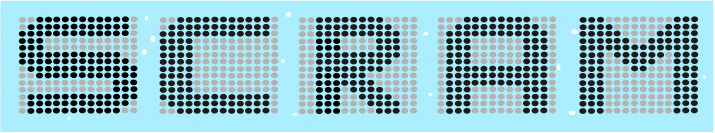

.. raw:: html

    
  

.. raw:: html

    

SCRAM
=====

**SCRAM** is a **C**\ommand-line **R**\isk **A**\nalysis **M**\ulti-tool.

SCRAM is under development to be a free and open source probabilistic risk analysis tool
to perform fault tree analysis, event tree analysis, uncertainty analysis,
importance analysis, common-cause analysis, and other probabilistic analysis types.

SCRAM is licensed under the GPLv3_.
The source code and issue/bug tracker are located at `GitHub <https://github.com/rakhimov/scram>`_.

.. _GPLv3:
    https://github.com/rakhimov/scram/blob/master/LICENSE

Implemented Features
--------------------

- Static fault tree analysis (MOCUS/BDD/ZBDD)
- Non-coherent analysis containing NOT logic or complements
- Analysis with common-cause failure models
- Probability calculations with importance analysis
- Uncertainty analysis with Monte Carlo simulations
- Fault tree generator
- Fault tree graphing with Graphviz Dot tool
- OpenPSA Model Exchange Format

Installation
------------

.. toctree::
    :maxdepth: 2

    ../doc/installation.rst

Documentation
-------------

Development
~~~~~~~~~~~

.. toctree::
    :maxdepth: 1

    doc/design_description
    doc/coding_standards
    doc/todo
    doc/bugs

Analysis
~~~~~~~~

.. toctree::
    :maxdepth: 1

    doc/description
    doc/fault_tree_analysis
    doc/fta_preprocessing
    doc/fta_algorithms
    doc/probability_analysis
    doc/uncertainty_analysis
    doc/common_cause_analysis

Format
~~~~~~

.. toctree::
    :maxdepth: 1

    doc/input_file
    doc/config_file
    doc/report_layer
    doc/opsa_support

Tools
~~~~~

.. toctree::
    :maxdepth: 1

    doc/fault_tree_generator
    doc/fault_tree_graphing
    doc/gui

Misc.
~~~~~

.. toctree::
    :maxdepth: 1

    doc/theory.rst
    doc/references
    doc/xml_comments

Contact Us
----------

- `Mailing List and Forum`_

.. _Mailing List and Forum: https://groups.google.com/forum/#!forum/scram-dev
